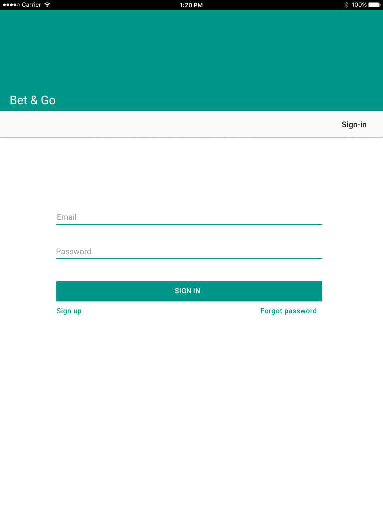
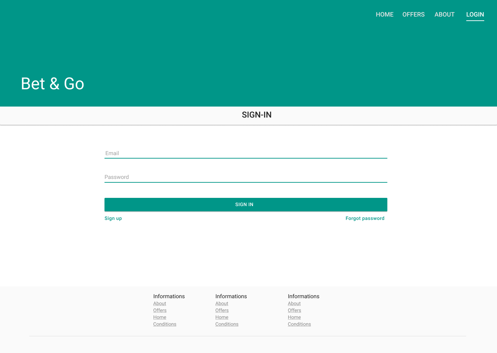

# MontreuilCPROA-html
Integrer une maquette en html / css

A partir de la maquette que vous avez créé avec un outils de design (cf. competence 01), vous devez faire l'intégration HTML / CSS de cette maquette.

La page html doit correspondre au design présenté dans la maquette.

## Maquette

1. Mobile design

2. Tablet Design

3. Desktop Design

